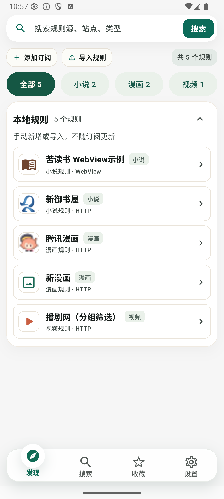
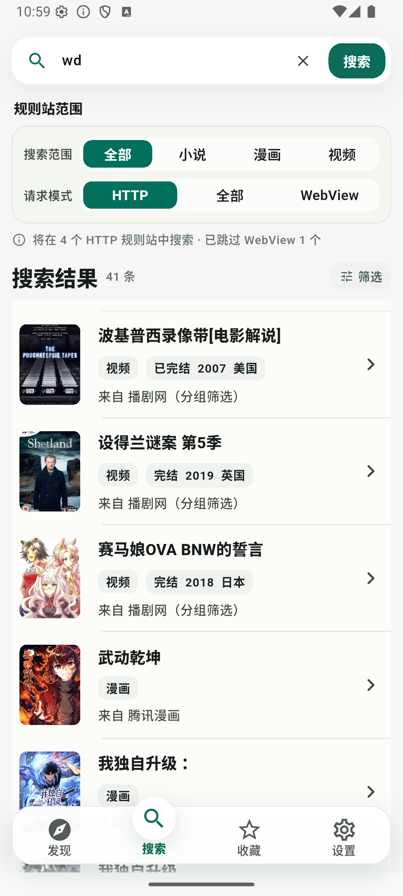
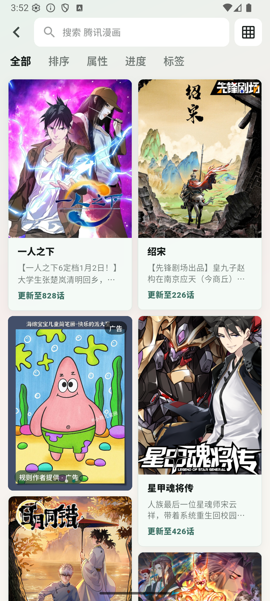
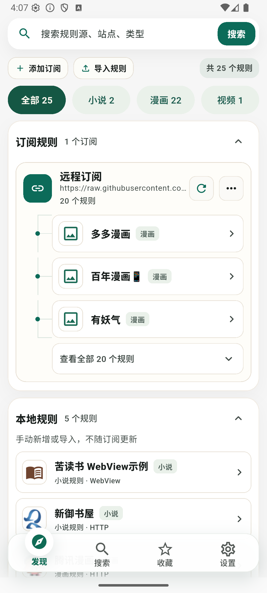
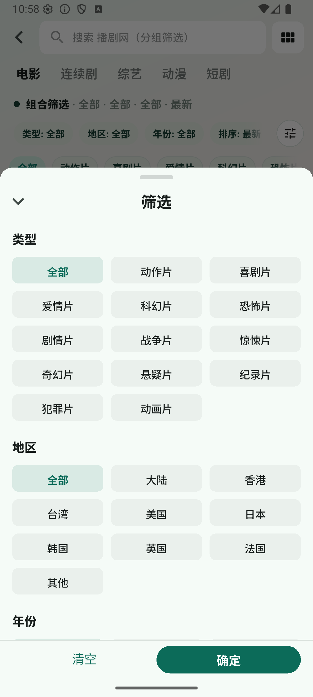
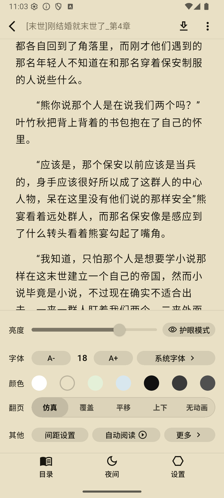
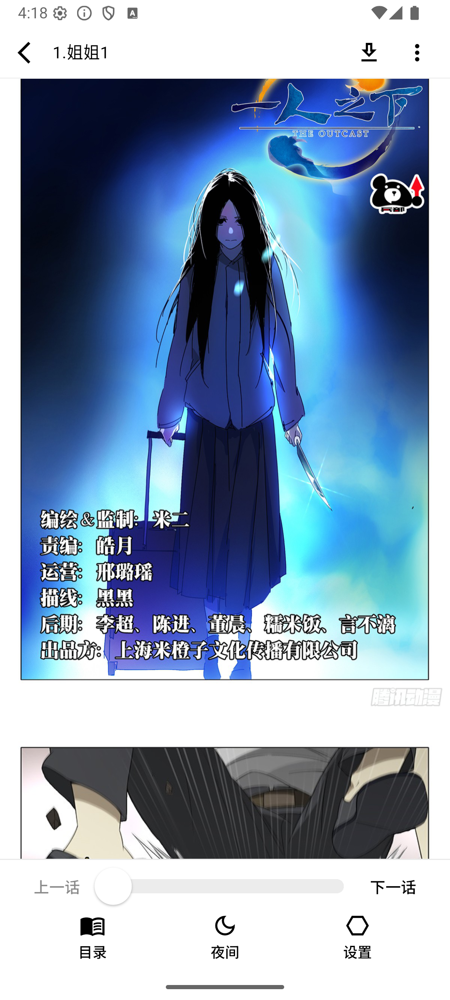
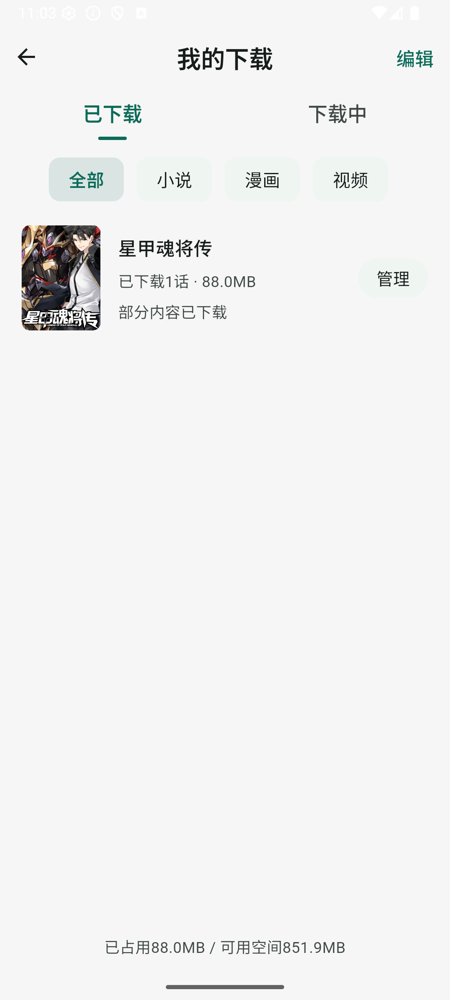

# 爱看

爱看是一款规则驱动的内容聚合与阅读应用，支持小说、漫画、视频等多种内容类型。通过灵活的规则配置，可以完成内容发现、搜索、详情解析、章节获取及正文阅读，无需针对不同内容源单独开发客户端。

[下载最新版本](https://github.com/qucomic/ikan_source/releases/latest) · [规则手册](rules/README.md) · [规则示例](#规则示例)

## 下载 APK

请前往 [GitHub Releases](https://github.com/qucomic/ikan_source/releases/latest) 下载最新版本。

[直接下载最新版 APK](https://github.com/qucomic/ikan_source/releases/latest/download/ikan.apk)

### 运行要求

- Android 7.0（API 24）及以上版本
- 安装第三方 APK 时，可能需要根据系统提示允许“安装未知应用”

## 项目截图

| 首页 | 搜索 | 规则发现 |
|:---:|:---:|:---:|
|  |  |  |

| 内容发现 | 分类 | 小说阅读 |
|:---:|:---:|:---:|
|  |  |  |

| 漫画阅读 | 视频播放 | 下载管理 |
|:---:|:---:|:---:|
|  |  |  |

## 项目特色

- 支持小说、漫画、视频等多种内容类型
- 支持发现、搜索、目录和正文解析
- 支持自定义请求、分页、选择器及 JavaScript 处理逻辑
- 支持文字、图片、视频等内容形式
- 规则与客户端分离，可独立发布和更新
- 规则作者可以自主创建、维护并运营自己的项目
- 支持规则作者自定义广告、推广内容等运营配置
- 提供统一的移动端阅读体验

## 规则作者自主运营

爱看为规则作者提供开放的规则能力。规则作者可以根据自身需求接入内容源，独立维护规则项目，并自行决定项目的更新、发布和运营方式。

规则作者可配置包括但不限于：

- 内容源、分类及搜索功能
- 规则名称、图标和内容来源
- 规则订阅与版本更新
- 广告内容和展示配置
- 其他与规则项目相关的运营内容

### 运营流程

1. 编写规则，并将规则 JSON 文件发布到用户可以访问的 HTTPS 地址。
2. 如需配置作者广告，在规则的 `adUrl` 字段中填写独立的广告数据地址。
3. 用户在爱看中添加规则订阅地址，即可导入对应规则。
4. 规则内容更新后，用户更新订阅即可获取最新配置。
5. 广告数据可以独立维护，客户端再次加载广告数据时即可获取更新，无需重新发布规则。

> 规则订阅地址与广告数据地址是两个不同的地址，请勿混用。广告地址必须是 HTTPS 链接，并返回符合格式要求的 JSON 数据，而不是广告图片地址。

规则与广告数据可以托管在 GitHub 等公开平台，无需自行部署后端服务，可降低项目运营成本。客户端负责提供规则运行和内容阅读能力，各规则项目由对应作者自行维护和运营。

## 规则示例

- [小说规则示例](https://raw.githubusercontent.com/qucomic/ikan_source/refs/heads/main/rule_example/novel.json)
- [漫画规则示例](https://raw.githubusercontent.com/qucomic/ikan_source/refs/heads/main/rule_example/manga.json)
- [视频规则示例](https://raw.githubusercontent.com/qucomic/ikan_source/refs/heads/main/rule_example/video.json)
- [广告配置示例](https://raw.githubusercontent.com/qucomic/ikan_source/refs/heads/main/rule_example/rule_ads.json)

## 规则开发

爱看支持通过 JSON 规则接入小说、漫画和视频内容源。规则作者可以从规则手册总览开始阅读，并根据需要查阅字段、请求、解析和排错文档。

1. [规则手册总览](rules/README.md)
2. [字段字典](rules/01-fields.md)
3. [地址与请求规则](rules/02-address-and-request.md)
4. [选择器与取值规则](rules/03-selectors-and-values.md)
5. [JavaScript 规则](rules/04-javascript.md)
6. [分页、上下文与会话](rules/05-pagination-and-session.md)
7. [图片请求、AES 解密与命名 JS](rules/06-images-and-transforms.md)
8. [完整规则示例](rules/07-examples.md)
9. [常见错误与排查](rules/08-troubleshooting.md)

## 使用声明

爱看仅提供规则运行和内容阅读能力，不提供或存储第三方内容。本仓库中的规则和广告示例仅用于说明配置格式。

规则作者应确保其规则、内容来源、广告及推广信息符合相关法律法规和第三方平台条款，并对自行发布和运营的内容负责。

## 问题反馈

使用问题和规则开发问题可以通过 [GitHub Issues](https://github.com/qucomic/ikan_source/issues) 反馈。提交问题时，建议附上应用版本、Android 版本、设备型号和复现步骤。

## 关于本仓库

本仓库用于发布项目介绍、规则文档、应用截图及 APK 安装包，应用源代码暂不公开。
