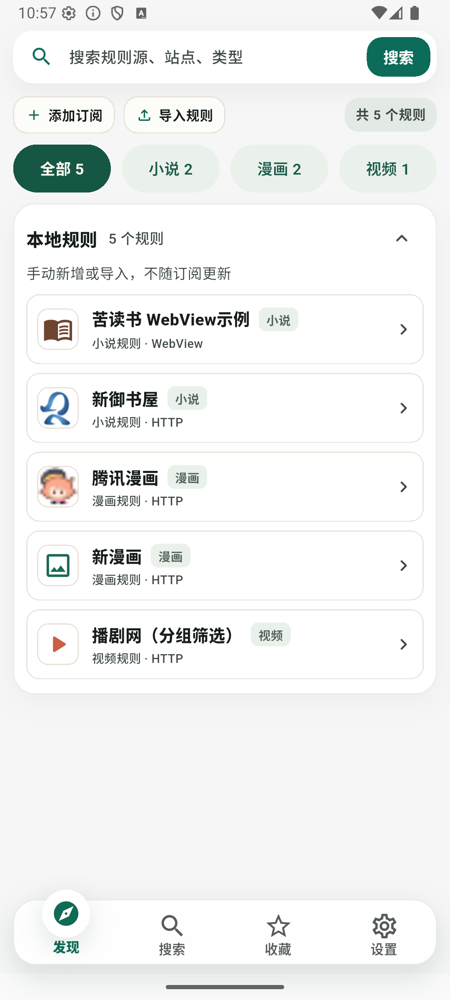
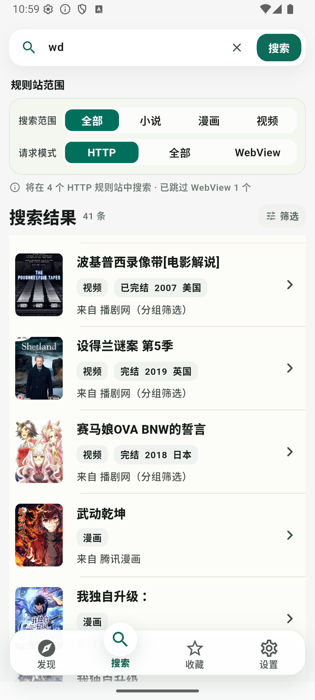
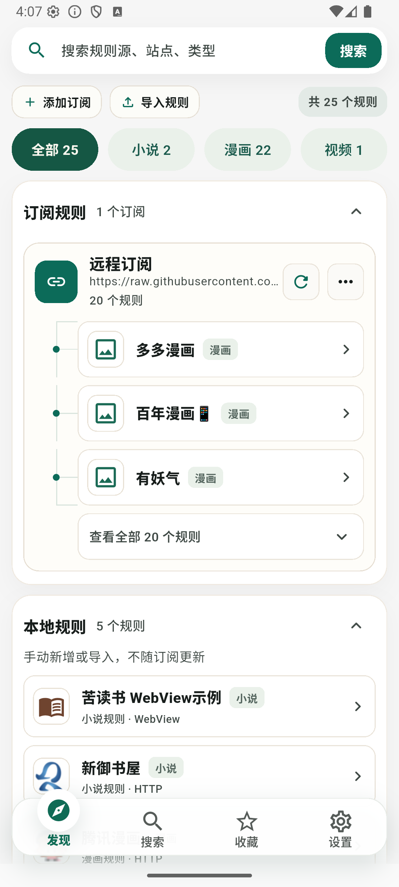
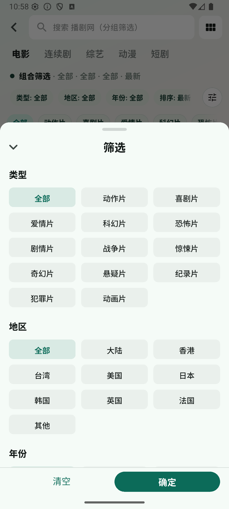
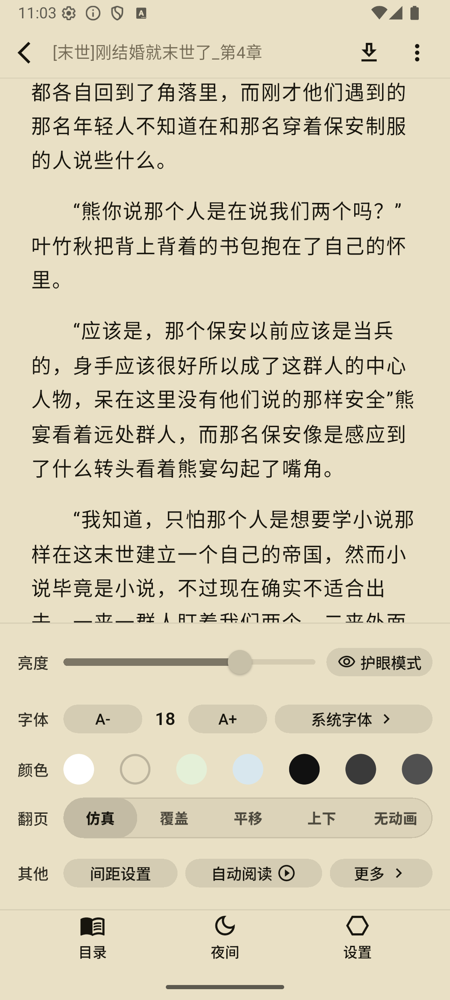
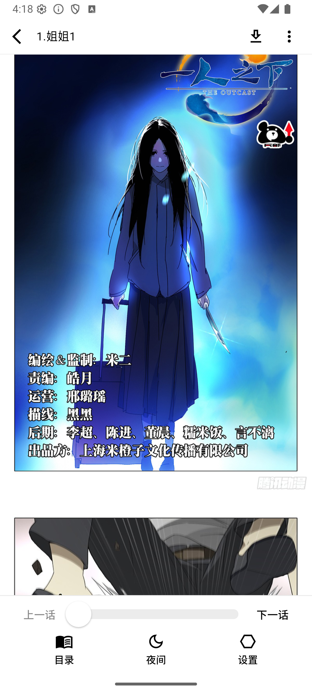
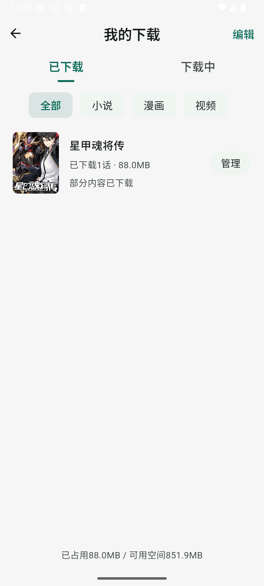

# 爱看

爱看是一款规则驱动的内容聚合与阅读器应用，支持小说、漫画、视频等多种内容类型。通过灵活的规则配置，可以完成内容发现、搜索、详情解析、章节获取及正文阅读，无需针对不同内容源单独开发客户端。

[下载最新版本](https://github.com/qucomic/ikan_source/releases/latest) · [使用演示](#使用演示) · [规则手册](rules/README.md) · [规则示例](#规则示例) · [Agent Skill](#使用-ai-智能体辅助编写规则)

## 下载安装

请前往 [GitHub Releases](https://github.com/qucomic/ikan_source/releases/latest) 下载最新版本。根据使用的平台选择对应安装包：

| 平台 | 安装包 | 下载与安装 |
| --- | --- | --- |
| Android | APK | [直接下载最新版 APK](https://github.com/qucomic/ikan_source/releases/latest/download/ikan.apk)，下载后按系统提示安装。 |
| macOS | ZIP 压缩包 | [直接下载最新版macOS ZIP](https://github.com/qucomic/ikan_source/releases/latest/download/ikan-macos.zip)，在最新版 Release 的 Assets 中下载 macOS ZIP，解压后打开应用；也可以将应用拖入“应用程序”文件夹。 |
<!-- | Windows | ZIP 压缩包 | 在最新版 Release 的 Assets 中下载 Windows ZIP，完整解压后运行其中的应用程序。请勿直接在压缩包内运行。 | -->

### 运行要求

- Android：Android 7.0（API 24）及以上版本。安装第三方 APK 时，可能需要根据系统提示允许“安装未知应用”。
- macOS：首次打开时，如果系统提示应用来自未认证的开发者，请在“系统设置 → 隐私与安全性”中确认后重新打开。
<!-- - Windows：下载完成后先解压全部文件，并保留压缩包内原有的目录结构。如果 Windows 安全提示阻止运行，请确认安装包来自本仓库的 Release 页面后再选择继续。 -->

> macOS 与 Windows 安装包均为 ZIP 压缩文件。不同平台的文件不能混用；如 Release 中提供多个架构版本，请根据设备和 Release 说明选择对应文件。

## 使用演示

https://github.com/user-attachments/assets/117ab3ae-7a68-4127-ab8f-c14c652375f4

演示视频展示爱看 App 的实际操作，帮助你直观了解应用界面与使用方式。首次使用时，可结合下方项目截图和规则手册了解相关功能；应用中的内容需要通过规则接入。

如浏览器无法直接播放，可下载视频后使用本地播放器观看。

## 项目截图

| 首页 | 搜索 | 规则发现 |
|:---:|:---:|:---:|
|  |  |  |

| 内容发现 | 分类 | 小说阅读 |
|:---:|:---:|:---:|
|  |  |  |

| 漫画阅读 | 视频播放 | 下载管理 |
|:---:|:---:|:---:|
|  |  |  |

## 项目特色

- 支持小说、漫画、视频等多种内容类型
- 支持发现、搜索、目录和正文解析
- 支持自定义请求、分页、选择器及 JavaScript 处理逻辑
- 支持文字、图片、视频等内容形式
- 规则与客户端分离，可独立发布和更新
- 规则作者可以自主创建、维护并运营自己的项目
- 支持规则作者自定义广告、推广内容等运营配置
- 提供统一的移动端阅读体验

## 规则作者自主运营

爱看为规则作者提供开放的规则能力。规则作者可以根据自身需求接入内容源，独立维护规则项目，并自行决定项目的更新、发布和运营方式。

规则作者可配置包括但不限于：

- 内容源、分类及搜索功能
- 规则名称、图标和内容来源
- 规则订阅，修改订阅内容
- 把订阅地址制作成二维码，用户可扫码订阅
- 广告内容和展示配置
- 其他与规则项目相关的运营内容

### 运营流程

1. 编写规则，并将规则 JSON 文件发布到用户可以访问的 HTTPS 地址。
2. 如需配置作者广告，在规则的 `adUrl` 字段中填写独立的广告数据地址。
3. 用户在爱看中添加规则订阅地址，即可导入对应规则。
4. 规则内容更新后，用户更新订阅即可获取最新配置。
5. 广告数据可以独立维护，客户端再次加载广告数据时即可获取更新，无需重新发布规则。

> 规则订阅地址与广告数据地址是两个不同的地址，请勿混用。广告地址必须是 HTTPS 链接，并返回符合格式要求的 JSON 数据，而不是广告图片地址。

### 广告字段说明

广告数据地址返回一个 JSON 对象，字段要求如下：

| 字段 | 说明 |
| --- | --- |
| `version` | 必填整数，当前固定为 `1`。 |
| `ads` | 必填数组；空数组表示没有作者广告。 |
| `id` | 必填，不能为空，并且在单次响应内唯一。 |
| `placement` | 必填；支持 `category_masonry`、`detail_card`、`reader_chapter_end`、`video_preroll`。 |
| `imageUrl` / `targetUrl` | 图片广告使用，必须是绝对 HTTPS 地址。 |
| `videoUrl` | 片头广告必填，必须是 HTTPS MP4 地址。视频实际时长最长 15 秒，播放 5 秒后允许跳过；10 秒内未开始播放时，客户端会直接进入正片。 |
| `posterUrl` | 片头广告可选，用于视频加载期间展示，必须是绝对 HTTPS 地址。 |
| `title` | 详情广告和阅读广告必填；分类广告不使用；片头广告可选。 |
| `description` / `buttonText` | 详情广告和阅读广告可选。 |
| `openMode` | 可选；`in_app` 表示使用应用内网页打开，`external` 表示交给系统处理，默认为 `in_app`。 |

素材与数量限制：

- 图片比例：分类广告为 5:7，详情广告为 1:1，阅读广告为 1:1；客户端会对比例不同的素材进行居中裁剪。
- 数量限制：每个广告位最多读取前 5 条有效广告。

规则与广告数据可以托管在 GitHub 等公开平台，无需自行部署后端服务，可降低项目运营成本。客户端负责提供规则运行和内容阅读能力，各规则项目由对应作者自行维护和运营。

## 规则示例

- [小说规则示例](https://raw.githubusercontent.com/qucomic/ikan_source/refs/heads/main/rule_example/novel.json)
- [漫画规则示例](https://raw.githubusercontent.com/qucomic/ikan_source/refs/heads/main/rule_example/manga.json)
- [视频规则示例](https://raw.githubusercontent.com/qucomic/ikan_source/refs/heads/main/rule_example/video.json)
- [广告配置示例](https://raw.githubusercontent.com/qucomic/ikan_source/refs/heads/main/rule_example/rule_ads.json)

## 规则开发

爱看支持通过 JSON 规则接入小说、漫画和视频内容源。规则作者可以从规则手册总览开始阅读，并根据需要查阅字段、请求、解析和排错文档。

1. [规则手册总览](rules/README.md)
2. [字段字典](rules/01-fields.md)
3. [地址与请求规则](rules/02-address-and-request.md)
4. [选择器与取值规则](rules/03-selectors-and-values.md)
5. [JavaScript 规则](rules/04-javascript.md)
6. [分页、上下文与会话](rules/05-pagination-and-session.md)
7. [图片请求、AES 解密与命名 JS](rules/06-images-and-transforms.md)
8. [完整规则示例](rules/07-examples.md)
9. [常见错误与排查](rules/08-troubleshooting.md)

## 使用 AI 智能体辅助编写规则

本仓库内置通用的 [`writing-ikan-rules` Agent Skill](.agents/skills/writing-ikan-rules/SKILL.md)，可供 Codex 及其他支持 Agent Skills 的智能体辅助编写、检查和调试爱看 JSON 规则。

Skill 位于：

```text
.agents/skills/writing-ikan-rules/
```

支持 `.agents/skills/` 的智能体可以自动发现该 Skill。若当前智能体不能自动发现，可以要求它先读取：

```text
.agents/skills/writing-ikan-rules/SKILL.md
```

不同智能体的 Skill 安装目录和自动发现方式可能不同，请以对应工具的说明为准。即使不支持自动发现，也可以让智能体直接读取 `SKILL.md` 并遵循其中的规则。
智能体内置legado“阅读”书源转换脚本，可将“阅读”书源规则转换为ikan规则，不能100%转换，只能做到部分内容转换，后续可自行调整完善。

### 提示词示例

```text
请先读取并遵循
.agents/skills/writing-ikan-rules/SKILL.md，
为 https://example.com 编写一条完整的漫画规则。

规则作者填写“测试”，需要支持搜索、组合分类、多线路目录和漫画阅读。
请先检查网站的真实 API；只有无法直接使用 API 时才使用 WebView。
完成后验证搜索、分类、目录、正文、分页和图片请求头。
```

生成规则后，可以运行验证器：

```bash
python3 .agents/skills/writing-ikan-rules/scripts/validate_rule.py rules/example.json
```

验证器用于检查字段、选择器和已知的不兼容写法。验证通过不代表目标网站一定可用，还需要在爱看 App 中实际测试搜索、分类、目录、正文、分页和图片加载。

## 使用声明

爱看仅提供规则运行和内容阅读能力，不提供或存储第三方内容。本仓库中的规则和广告示例仅用于说明配置格式。

规则作者应确保其规则、内容来源、广告及推广信息符合相关法律法规和第三方平台条款，并对自行发布和运营的内容负责。

## 问题反馈

使用问题和规则开发问题可以通过 [GitHub Issues](https://github.com/qucomic/ikan_source/issues) 反馈。提交问题时，建议附上应用版本、Android 版本、设备型号和复现步骤。

## 关于本仓库

本仓库用于发布项目介绍、规则文档、应用截图，以及 Android、macOS 和 Windows 安装包，应用源代码暂不公开。
